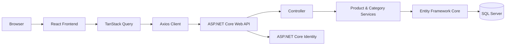
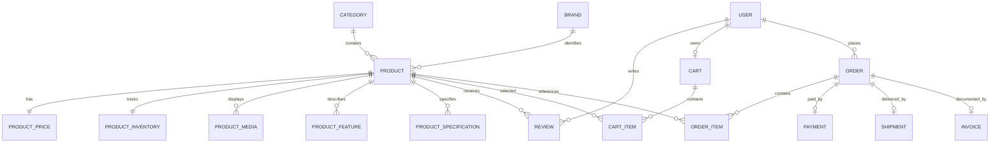

<div align="center">

# Corevia

**Eine moderne Fullstack-Commerce-Plattform mit React, ASP.NET Core und SQL Server.**


</div>

## Überblick

Corevia ist eine in Entwicklung befindliche Fullstack-Anwendung für einen digitalen Shop. Das Projekt verbindet einen responsiven Produktkatalog mit einer ASP.NET-Core-Web-API und einem umfangreichen, relationalen Commerce-Datenmodell.

Der aktuelle Schwerpunkt liegt auf der Produktdarstellung, Produktsuche, Kategoriefilterung und Detailansicht. Gleichzeitig ist das Backend bereits für weitere Shop-Bereiche wie Benutzerkonten, Warenkörbe, Bestellungen, Zahlungen, Versand, Rechnungen und Bewertungen modelliert.

> **Projektstatus:** Das Projekt ist ein aktiver Prototyp. Umgesetzte Funktionen und vorbereitete Erweiterungen werden in dieser README bewusst getrennt dargestellt.

## Projekt-Highlights

- Durchgängig typisierte Fullstack-Entwicklung mit **C#**, **TypeScript** und DTOs
- REST-API mit Suche, Filtern, Pagination und projektierten Datenbankabfragen
- Asynchrones Datenmanagement im Frontend mit **TanStack Query** und **Axios**
- Produktdetailseite mit Bilderkarussell, Preisen, Lagerstatus, Merkmalen, Spezifikationen und Bewertungen
- Hierarchische Kategorien mit berechneten Produktanzahlen
- Umfangreiches EF-Core-Domänenmodell für zentrale E-Commerce-Prozesse
- Rollen- und Benutzerverwaltung mit **ASP.NET Core Identity**
- Automatische Migration und Entwicklungs-Seeddaten beim Start der API
- Responsive Benutzeroberfläche mit **Tailwind CSS** sowie Hell- und Dunkelmodus
- Klare Aufteilung in Domain-, Application-, Infrastructure-, API- und Frontend-Bereiche

## Aktueller Funktionsumfang

| Bereich | Status | Beschreibung |
|---|---:|---|
| Startseite | ✅ | Hero-Bereich, Funktionsübersicht und Navigation zum Produktkatalog |
| Produktkatalog | ✅ | Responsive Produktkarten mit Bild, Marke, Preis, Rabatt und Verfügbarkeit |
| Produktsuche | ✅ | Suche nach Name, SKU, Untertitel, Beschreibung, Kategorie und Marke |
| Kategoriefilter | ✅ | Haupt- und Unterkategorien mit Produktanzahlen |
| Produktfilter-API | ✅ | Kategorie, Mindestpreis, Höchstpreis und Verfügbarkeit |
| Pagination im Backend | ✅ | Konfigurierbare Seiten und Seitengrösse mit Begrenzung auf 50 Einträge |
| Produktdetails | ✅ | Bilder, Merkmale, Spezifikationen, Lagerbestand und freigegebene Bewertungen |
| Dark Mode | ✅ | Umschaltbares helles und dunkles Farbschema |
| Identity-Backend | ✅ | Registrierung, Anmeldung, Rollen und Benutzerverwaltung über ASP.NET Core Identity |
| Warenkorb und Checkout | 🧱 | Datenmodell vorhanden, Benutzeroberfläche und API noch nicht umgesetzt |
| Bestellungen und Zahlungen | 🧱 | Datenmodell vorhanden, Workflows und Endpunkte noch nicht umgesetzt |
| Administrationsbereich | 🚧 | Als zukünftige Erweiterung vorgesehen |
| Automatisierte Tests | 🚧 | Noch kein Testprojekt im Repository vorhanden |

## Architektur



### Lösungsstruktur

```text
Corevia-main/
├── backend/
│   ├── Corevia.Domain/          # Entitäten, Identity-Modelle und Rollen
│   ├── Corevia.Application/     # DTOs und anwendungsbezogene Datenverträge
│   ├── Corevia.Infrastructure/  # Vorbereitete Schicht für technische Integrationen
│   └── Corevia.Shop.Api/        # API, Controller, Services, EF Core und Migrationen
├── frontend/
│   └── corevia-shop-web/        # React-, TypeScript- und Vite-Anwendung
└── README.md
```

Die Persistenz- und Service-Implementierung befindet sich im aktuellen Entwicklungsstand hauptsächlich im API-Projekt. Die Infrastructure-Schicht ist für eine spätere Auslagerung technischer Implementierungen vorbereitet.

## Technologiestack

### Frontend

| Technologie | Verwendung |
|---|---|
| React 19 | Komponentenbasierte Benutzeroberfläche |
| TypeScript | Statische Typisierung und API-Modelle |
| Vite | Entwicklungsserver und Produktions-Build |
| Tailwind CSS 4 | Responsive Gestaltung und Dark Mode |
| TanStack Query 5 | Server-State, Caching und Ladezustände |
| Axios | HTTP-Kommunikation mit der Web-API |
| React Router | Navigation zwischen Startseite, Katalog und Produktdetails |
| Lucide React | UI-Icons |

### Backend

| Technologie | Verwendung |
|---|---|
| ASP.NET Core 10 | REST-API und HTTP-Pipeline |
| Entity Framework Core 10 | Datenzugriff, Relationen und Migrationen |
| SQL Server | Relationale Datenbank |
| ASP.NET Core Identity | Benutzer, Rollen und Authentifizierungsendpunkte |
| Scalar | Interaktive API-Referenz in der Entwicklungsumgebung |

## Datenmodell

Das Backend bildet nicht nur den aktuellen Produktkatalog ab, sondern bereitet zentrale E-Commerce-Prozesse bereits auf Domänenebene vor.



Weitere modellierte Bereiche umfassen unter anderem Produktvarianten, SEO-Daten, Tags, Dokumente, Analytics, Lieferanten, Hersteller, Adressen, Benachrichtigungseinstellungen und Bewertungsreaktionen.

## API

### Produktliste

```http
GET /Products
```

Unterstützte Query-Parameter:

| Parameter | Typ | Beschreibung |
|---|---|---|
| `Search` | string | Volltextähnliche Suche in mehreren Produktfeldern |
| `CategoryId` | integer | Filter nach einer Kategorie |
| `MinPrice` | decimal | Minimaler Produktpreis |
| `MaxPrice` | decimal | Maximaler Produktpreis |
| `OnlyAvailable` | boolean | Filter nach Verfügbarkeit |
| `Page` | integer | Gewünschte Seite, Standardwert `1` |
| `PageSize` | integer | Einträge pro Seite, Standardwert `12`, maximal `50` |

Beispiel:

```http
GET /Products?Search=monitor&MinPrice=100&MaxPrice=1000&OnlyAvailable=true&Page=1&PageSize=12
```

Antwortstruktur:

```json
{
  "items": [],
  "totalCount": 0,
  "page": 1,
  "pageSize": 12
}
```

### Produktdetails

```http
GET /Products/{id}
```

Liefert unter anderem:

- Stammdaten und SKU
- Kategorie und Marke
- Normal- und Rabattpreis
- Bestand und Verfügbarkeit
- Produktbilder
- Merkmale und technische Spezifikationen
- Sichtbare und freigegebene Bewertungen

### Kategoriefilter

```http
GET /api/categories/filters
```

Liefert eine hierarchische Kategoriestruktur mit Unterkategorien und berechneten Produktanzahlen.

### Identity

Die API bindet die Standardendpunkte von ASP.NET Core Identity ein. Die Authentifizierungsoberfläche im React-Frontend ist im aktuellen Stand noch nicht implementiert.

## Frontend-Routen

| Route | Ansicht |
|---|---|
| `/` | Startseite |
| `/products` | Produktkatalog |
| `/products/:productId` | Produktdetailseite |

## Lokale Installation

### Voraussetzungen

- [.NET SDK 10](https://dotnet.microsoft.com/)
- Node.js **22.22 oder neuer**
- npm
- Lokale oder erreichbare SQL-Server-Instanz

### 1. Repository klonen

```bash
git clone <REPOSITORY-URL>
cd Corevia-main
```

### 2. Datenbankverbindung konfigurieren

Das Repository enthält bewusst kein Datenbankpasswort. Die Connection-String-Konfiguration wird lokal über eine Umgebungsvariable gesetzt.

**PowerShell:**

```powershell
$env:ConnectionStrings__DefaultConnection="Server=localhost,1433;Database=CoreviaDb;User Id=sa;Password=<DEIN_PASSWORT>;TrustServerCertificate=True;"
```

**Bash:**

```bash
export ConnectionStrings__DefaultConnection='Server=localhost,1433;Database=CoreviaDb;User Id=sa;Password=<DEIN_PASSWORT>;TrustServerCertificate=True;'
```

### 3. Backend starten

```bash
dotnet restore backend/Corevia.Shop.Api/Corevia.Shop.Api.csproj
dotnet run --project backend/Corevia.Shop.Api/Corevia.Shop.Api.csproj
```

Die lokale HTTP-Adresse ist gemäss Entwicklungsprofil:

```text
http://localhost:5196
```

In der Entwicklungsumgebung werden vorhandene EF-Core-Migrationen automatisch angewendet und Beispieldaten angelegt. Die interaktive Scalar-API-Referenz wird ebenfalls nur im Development-Modus aktiviert.

### 4. Frontend konfigurieren

```bash
cd frontend/corevia-shop-web
cp .env.example .env
```

Unter Windows PowerShell:

```powershell
Copy-Item .env.example .env
```

Inhalt der lokalen `.env`:

```env
VITE_API_URL=http://localhost:5196
```

### 5. Frontend starten

```bash
npm install
npm run dev
```

Die Anwendung läuft anschliessend standardmässig unter:

```text
http://localhost:5173
```

## Verfügbare Frontend-Befehle

```bash
npm run dev      # Entwicklungsserver
npm run build    # TypeScript-Prüfung und Produktions-Build
npm run lint     # ESLint-Prüfung
npm run preview  # Vorschau des Produktions-Builds
```

## Technische Entscheidungen

### DTO-Projektionen statt vollständiger Entitäten

Die API projiziert Produktlisten und Produktdetails direkt auf passende DTOs. Dadurch werden nur die benötigten Daten geladen und keine EF-Core-Entitäten unkontrolliert an das Frontend übertragen.

### Optimierte Leseabfragen

Produkt- und Kategorieabfragen verwenden `AsNoTracking()`, weil die gelesenen Daten in diesen Endpunkten nicht verändert werden. Dies reduziert unnötigen Tracking-Overhead.

### Server-State mit TanStack Query

API-Daten, Ladezustände, Fehler und Caching werden zentral über TanStack Query verwaltet. Requests erhalten ein `AbortSignal`, damit nicht mehr benötigte Abfragen abgebrochen werden können.

### Relationales Commerce-Modell

Preise, Lagerbestand, Versanddaten, Medien, Spezifikationen und Statusinformationen sind als eigene Entitäten modelliert. Dadurch bleibt das Produktmodell erweiterbar und einzelne Verantwortlichkeiten werden klar getrennt.

### Rollenbasierte Erweiterbarkeit

Das Identity-Modell enthält Rollen für Kunden, Shop-Administration und interne Benutzer. Damit ist die Grundlage für geschützte Shop- und Business-Bereiche vorhanden.

## Sicherheit und öffentliche Nutzung

- Datenbankpasswörter und andere Secrets gehören nicht in das Repository.
- Lokale `.env`-Dateien werden nicht versioniert; `.env.example` enthält nur die benötigten Variablennamen.
- Die vorhandenen Seed-Benutzer und Seed-Daten sind ausschliesslich für die lokale Entwicklung gedacht.
- Vor einem produktiven Einsatz müssen CORS, Authentifizierung, Secret-Management, Logging und Fehlerbehandlung an die Zielumgebung angepasst werden.
- Generierte Ordner wie `bin`, `obj`, `node_modules` und `dist` werden über `.gitignore` ausgeschlossen.

## Roadmap

- Warenkorb- und Checkout-Workflow implementieren
- Bestell-, Zahlungs-, Versand- und Rechnungsendpunkte ergänzen
- Login, Registrierung und Benutzerkonto im Frontend anbinden
- Rollenbasierte Admin-Oberfläche entwickeln
- Preis-, Verfügbarkeits- und Pagination-Steuerung im Frontend ergänzen
- Produktverwaltung mit Create-, Update- und Delete-Funktionen umsetzen
- Automatisierte Unit-, Integration- und Frontend-Tests hinzufügen
- Validierung und zentrale API-Fehlerbehandlung erweitern
- Containerisierte Entwicklungsumgebung ergänzen
- CI-Pipeline für Build, Lint und Tests einrichten

## Was dieses Projekt demonstriert

Corevia zeigt den Aufbau einer modernen Fullstack-Anwendung von der Benutzeroberfläche bis zum relationalen Datenmodell. Im Mittelpunkt stehen eine saubere API-Anbindung, typisierte Datenflüsse, erweiterbare Domänenmodelle, performante Datenbankabfragen und eine Benutzeroberfläche, die reale Lade-, Fehler- und Leerzustände berücksichtigt.
